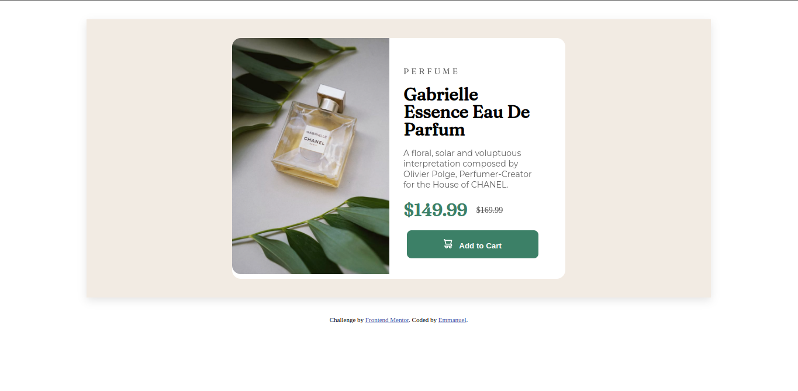
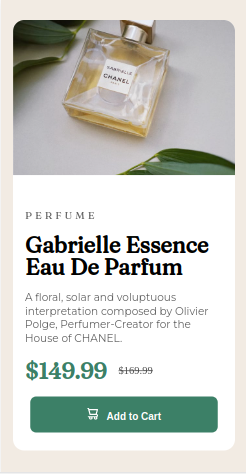

# Frontend Mentor - Product preview card component solution

This is a solution to the [Product preview card component challenge on Frontend Mentor](https://www.frontendmentor.io/challenges/product-preview-card-component-GO7UmttRfa). Frontend Mentor challenges help you improve your coding skills by building realistic projects. 

## Table of contents

- [Overview](#overview)
  - [The challenge](#the-challenge)
  - [Screenshot](#screenshot)
  - [Links](#links)
- [My process](#my-process)
  - [Built with](#built-with)
  - [What I learned](#what-i-learned)
  - [Continued development](#continued-development)
- [Author](#author)


## Overview
The challenge was to build out the given design and ensure that it was responsive based on the provided mobile and desktop designs


I'd rate the challenge at a beginner level.
It took me about three hours from start to completion


### The challenge

Users should be able to:

- View the optimal layout depending on their device's screen size
- See hover and focus states for interactive elements

### Screenshot




Screenshots of my solution, both the desktop design and the mobile design

### Links

- Solution URL: [GitHub](https://github.com/munyite001/Perfume-Product-Card-Component)
- Live Site URL: [Netlify]()

## My process
For this challenge, I decided to experiment with mobile first design.
So once I had outlined the variables based on the provided style guide, I used the global selector to reset the margin and padding to zero and also the box sizing to border-box. It is always good to start designing on a cean slate

Then once that's done, I set the global styles i.e., the body styles and the main styles
Then create the mobile layout. I found out that the trick to creating great styles with mobile first methodology, is to first analyze the design both desktop and mobile, ad see the structure of how everything fits together, then try to see how the breakpoints will come into place when shifting from one device to another.

Once you accomplish that, it will be very easier to start with mobile design then use media query to shift to desktop design

### Built with

- Semantic HTML5 markup
- CSS custom properties
- Flexbox
- Mobile-first workflow

### What I learned

I have learnt how to analyze designs and determine break points so that your designs are responsive.
I have also learned how to use two images in the same section but only displaying one in one design and displaying the other image when switching to the other design

```css
/* Images */
#mobile-image {
  width: 100%;
  border-top-left-radius: 15px;
  border-top-right-radius: 15px;
}
#desktop-image {
  width: 0;
  height: 0;
}
```

### Continued development

I want to continue building on the mobile first methodology, and also to master css grid layout to make it easier to shift between designs.


## Author

- Github - [Emmanuel Munyite](https://github.com/munyite001)
- Frontend Mentor - [@munyite001](https://www.frontendmentor.io/profile/munyite001)
- Twitter - [@Emunyite](https://www.twitter.com/emunyite)

